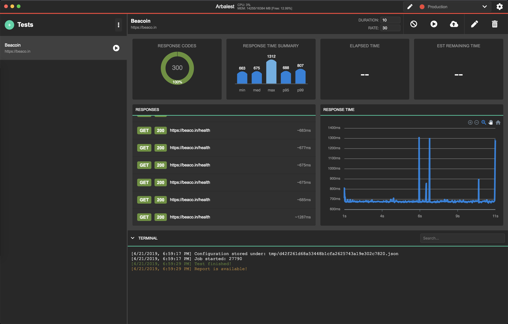

# Arbalest

Arbalest is a simple desktop app built on Electron that
uses Artillery (https://github.com/artilleryio/artillery) to configure and perform Load Testing.

The idea behind Arbalest is to make the Load Testing configuration as simple as possible. While it is possible to  perform the Load Testing of the servers using Arbalest, you would likely hit the limitation of your local machine before you hit the limitations of your server.

For this reason Arbalest is intended to be used to define those Tests and execute them in a small scale to confirm the expected request/response flow. Afterwards you can either export those configurations and run them using Artillery as part of your CI/CD pipeline or as on-premise solution using Artillery CLI.



Eventually I'd like to add the possibility to run the configuration with ad-hoc spun AWS Lambda/GCF/Azure Functions, so it can be triggered from your local machine while using the power of the Cloud, and host Arbalest as a service on a public domain.

To understand how is Artillery intended to be configured, please read https://artillery.io/docs/basic-concepts/.

## Features

- Create/Edit Load Tests by defining the URL, duration, rate per second and adding testing Scenarios
- Dynamic variables per environment
- Export/import Arbalest Tests for sharing
- Output of every response coming from the server
- Real time response time for every scenario in a test
- Response time report - min, max, median, p95 and p99

## Download

[Download for Mac](https://github.com/honzababarik/arbalest/releases/download/0.5.0/Arbalest-0.5.0.dmg)

Builds for Windows/Linux are not yet available. Since Arbalest is built using ElectronJS, theoretically it should't be a problem to provide these builds as well - I just haven't had the time to test those builds yet.

I encourage anyone with Windows/Linux to build Arbalest locally and to confirm it's working correctly, so I can publish those builds with confidence.

## Upcoming Features

- Export Tests as Artillery Configuration files to be used outside of Arbalest
- Run Test directly from Arbalest by ad-hoc spun AWS/GCF/Azure Functions
- Add additional graphs and analysis of response times
- Add Cookies to the request
- Add Sleep Scenario
- History of Test runs
- Variable randomizer with Faker.js integration
- Add Tests to Folders
- Multipart in Scenario payload
- Capture variables from responses
- Write custom scenario Before Request/After Response scripts using the GUI

## Build Locally

``` bash
# install dependencies
npm install

# serve with hot reload at localhost:9080
npm run dev

# --- OR ---

# build electron application for production
npm run build
```

## Contributing

The best way to help the project is to use report any issues (both bugs and missing features) in the issue tracker. If you want to get more involved, then you can comment on issues written by other people or send a pull request.

## License

Copyright 2019 Honza Babarik

Licensed under the Apache License, Version 2.0 (the "License");
you may not use this file except in compliance with the License.
You may obtain a copy of the License at

  http://www.apache.org/licenses/LICENSE-2.0

Unless required by applicable law or agreed to in writing, software
distributed under the License is distributed on an "AS IS" BASIS,
WITHOUT WARRANTIES OR CONDITIONS OF ANY KIND, either express or implied.
See the License for the specific language governing permissions and
limitations under the License.
